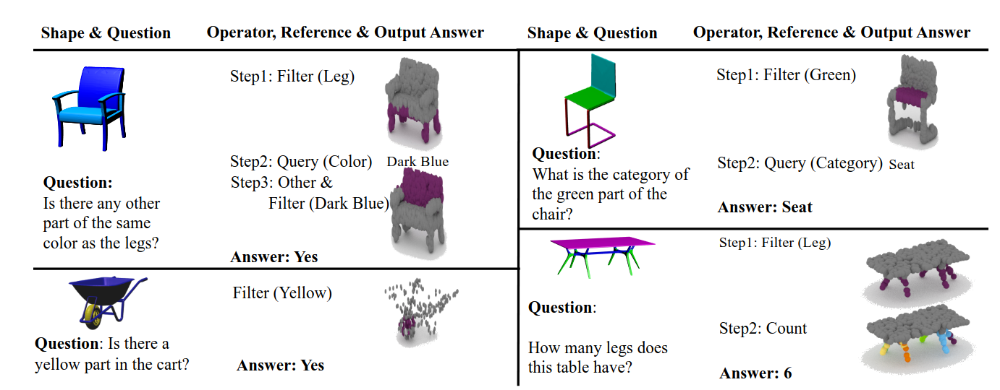
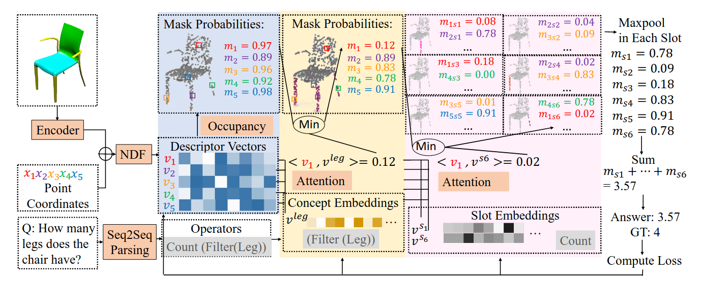
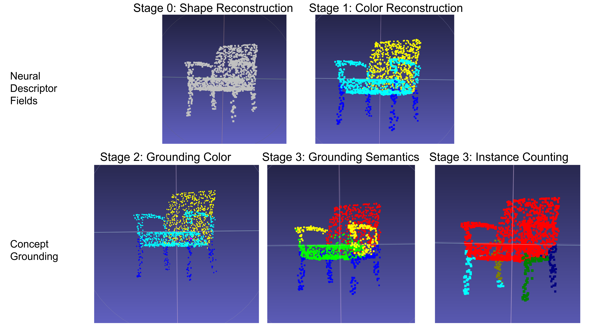

# 3D Concept Grounding on Neural Fields

PyTorch implementation for "3D Concept Grounding on Neural Fields (NeurIPS2022)"

<p align="center">

</p>

---

<p align="center">

</p>

[Paper](https://arxiv.org/abs/2207.06403) 

[Yining Hong](https://evelinehong.github.io/), [Yilun Du](https://yilundu.github.io/), Chunru Lin, [Joshua B. Tenenbaum](http://web.mit.edu/cocosci/josh.html), [Chuang Gan](https://people.csail.mit.edu/ganchuang/) 

## Setup
**Clone this repo**
```
git clone --recursive https://github.com/evelinehong/3D-Concept-Grounding.git
cd ndf
```
**Install dependencies** (using a virtual environment is highly recommended):
```
pip install -e .
```

**Setup environment variables** (this script must be sourced in each new terminal where code from this repository is run)
```
source ndf_env.sh
```

## Data & Checkpoints
Data and checkpoints (for all curriculum stages) are available at [Google Drive](https://drive.google.com/drive/folders/1y2LUFlVXeHgjCWLFpIU_wP4km2sVMg1J?usp=sharing). Please email yninghong@gmail.com if you experience problems about downloading.

Please put them under 3D-CG/src/ndf/training/data or 3D-CG/src/ndf/training/checkpoints

The data folder is like this:
```
shapes
  *.npz //contains the raw input images
parse_dicts
  *.pkl //contains ground-truth occupancy values for training the neural descriptor field
train.json //all training shapes
val.json //all testing shapes
train_questions.json //training questions, programs, answers (will be updated with more details)
val_questions.json //test questions
```

## Curriculum Learning
Our training script contains five stages:
* Stage 0: Learning **Shape Reconstruction**
* Stage 1: Learning **Color Reconstruction**
* Stage 2: Learning **Color Concepts** via Questions like "Is there a red part?"
* Stage 3: Learning **Semantic Concepts** via Questions like "What's the category of the red part?"
* Stage 4: Learning **Instance Counting** via Questions like "How many legs does this chair have?"

## Quickstart: Visualization
```
cd src/ndf/training
python train_vnn_occupancy_net.py 
    --checkpoint_path checkpoints/4.pth \ 
    --stage 3 \ 
    --vis True 
        //2 could be replaced by 0,1,2,3,4 for the visualization of any stage
```
We provide an example of visualization of the five stages (you could also see the vis folder under src/ndf/training for .ply files):
<p align="center">

</p>

## Training
For curriculum learning of different stages:
```
cd src/ndf/training
python train_vnn_occupancy_net.py 
    --experiment_name 0 
    --stage 0 
        //Training Stage 0
python train_vnn_occupancy_net.py 
    --experiment_name 0 
    --checkpoint_path checkpoints/0.pth 
    --stage 1 
        //Training Stage 1. Similar commands for training other stages.
```
After each stage, you can run the visualization above. 

## Testing
```
python train_vnn_occupancy_net.py 
    --checkpoint_path checkpoints/4.pth 
    --test True
```
We found a bug in the original codes so the testing performances are slightly better than the paper. :)

# Citing
If you find our paper or this code useful in your work, please cite our paper:
```
@article{hong20223dcg,
  title={3D Concept Grounding on Neural Fields},
  author={Hong, Yining and Du, Yilun and Lin, Chunru and Tenenbaum, Joshua B. and Gan, Chuang},
  journal={NeurIPS},
  year={2022}
}
```
